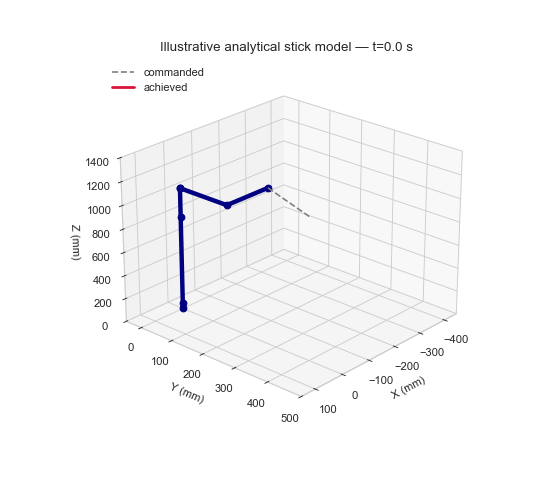
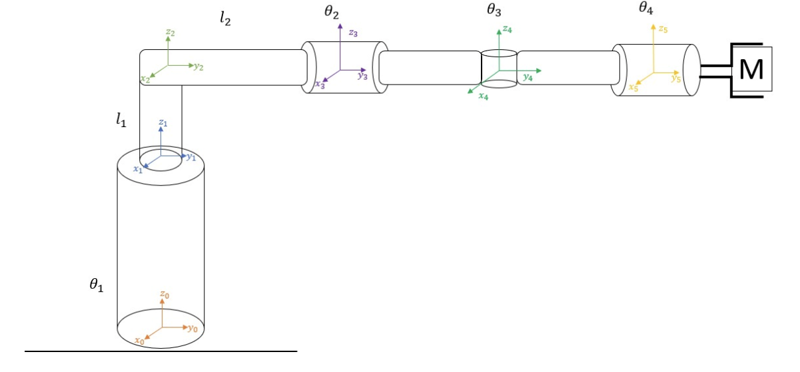
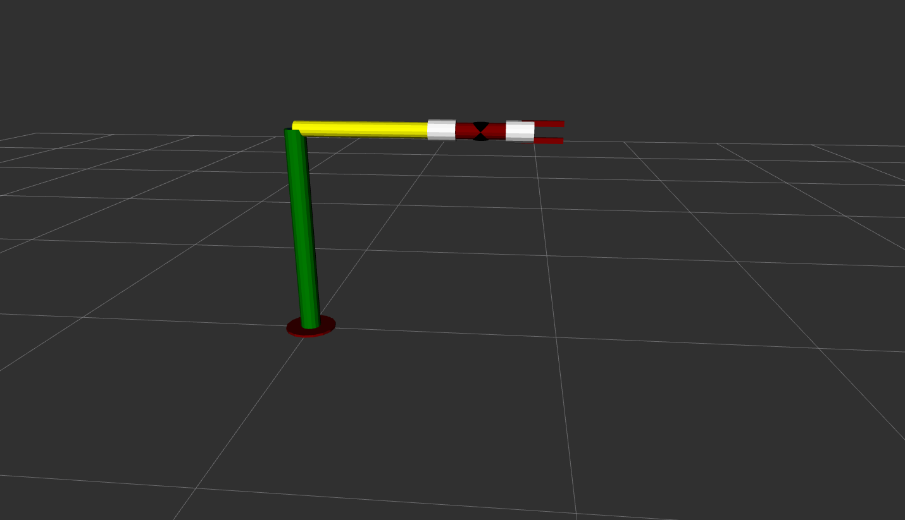

# 6-DOF SCARA Robot Project

A robotics engineering project covering the kinematics, workspace, differential motion,
trajectory planning, visualization, and simplified static-load analysis of a
six-degree-of-freedom SCARA-type robot. The proposed application is vision-guided
pick-and-place sorting between conveyor lines: an overhead inspection system identifies
defective products and the robot transfers them to a separate collection line.

The four-revolute/two-prismatic architecture provides a broad cylindrical workspace
with direct analytical kinematics, making it suitable for repeated sorting, packaging,
assembly, and material-transfer tasks.

## Start with the walkthrough

The fully executed Jupyter Notebook is the standalone technical documentation for the
project:

### [Open the complete SCARA 6-DOF walkthrough](notebooks/scara_6dof_walkthrough.ipynb)

GitHub displays its saved tables, plots, and analytical animation directly. The
notebook explains the application and model from first principles, validates five
corrected reference configurations and the analytical Jacobian, distinguishes commanded
from FK-achieved motion, and presents the ROS 2 and RViz implementation as the
visualization layer of the project.

## Notebook preview

### Analytical motion simulation



### Robot model and robotics visualization

| Coordinate-frame model | ROS robot visualization in RViz |
|---|---|
|  |  |

The complete notebook contains the application rationale, mathematical foundation,
corrected forward and inverse kinematics, five reference-case checks, Jacobian
validation, workspace analysis, trapezoidal trajectory equations, commanded-versus-
achieved trajectory validation, joint motion, velocity and static-load results, the
analytical animation, ROS 2/RViz presentation, limitations, future work, and technical
references.

## Analytical model

The canonical joint order is:

```text
[theta1, l1, l2, theta2, theta3, theta4]
```

- Angles are supplied in degrees.
- Linear dimensions are in millimetres.
- `l2` translates along local `+Y`.
- The implemented inverse solver is intentionally limited to position IK with an
  explicitly selected wrist posture; it is not a general full-pose 6-DOF solver.

The demonstration trajectory uses `theta2 = 0°` and `theta3 = 90°`, solves
`theta1`, `l1`, and `l2` analytically, and uses `theta4` only as an illustrative tool
spin. Unreachable positions raise an error instead of being silently clamped.

## Repository layout

```text
.
|-- scara_model.py                  # Shared analytical equations and trajectory logic
|-- simulation.py                   # Python/Matplotlib robot animation
|-- imges.py                        # Original graph-generation entry point
|-- notebooks/
|   |-- scara_6dof_walkthrough.ipynb
|   |-- scara_robot_animation.gif
|   `-- assets/                     # Project design diagrams and RViz capture
|-- scripts/
|   `-- execute_notebook.py         # No-Jupyter fallback executor
|-- tests/
|   `-- test_scara_model.py
|-- final_ws/                       # Original ROS 2/Xacro project workspace
`-- docs/
    `-- nstructions_for_that_code.pdf  # Original installation and operating notes
```

## Requirements

Python 3.9 or newer is recommended.

Core scripts and the saved notebook results require:

- NumPy
- Matplotlib
- Pillow, for GIF export

Interactive notebook use additionally requires JupyterLab or Jupyter Notebook.

Example installation in a virtual environment:

```bash
python -m venv .venv
```

Windows PowerShell:

```powershell
.venv\Scripts\Activate.ps1
python -m pip install numpy matplotlib pillow jupyterlab
```

Linux/macOS:

```bash
source .venv/bin/activate
python -m pip install numpy matplotlib pillow jupyterlab
```

## Run the notebook

With JupyterLab installed:

```bash
jupyter lab notebooks/scara_6dof_walkthrough.ipynb
```

The checked-in notebook has already been executed so GitHub can render its results.
This repository also includes a small fallback executor that captures stdout and
Matplotlib figures without Jupyter:

```bash
python scripts/execute_notebook.py notebooks/scara_6dof_walkthrough.ipynb
```

## Run the Python demonstrations

Generate the original analysis plots in the current directory:

```bash
python imges.py
```

Run the analytical 3D motion animation and export `scara_robot_simulation.gif`:

```bash
python simulation.py
```

The animation visualizes the corrected kinematic trajectory. It is not a
collision-aware, rigid-body, or controller simulation.

## Run the numerical checks

The focused checks use Python's built-in `unittest` module:

```bash
python -m unittest discover -s tests -v
```

They cover:

- the five corrected forward-kinematics reference cases;
- IK-to-FK consistency across the demonstrated trajectory;
- safe handling of a zero-distance trajectory.

## ROS 2 / RViz / Gazebo model

The robot kinematics and trajectory were developed and validated in Python. ROS 2 and
RViz were used to represent the robot structure and provide a robotics-oriented
visualization of the implementation. The ROS workspace is located in `final_ws/` and
preserves the Xacro model used during the project.

The six analytical joint variables have the following functional counterparts in the
ROS model:

```text
theta1  -> joint1  base rotation
l1      -> joint2  vertical prismatic extension
l2      -> joint3  horizontal prismatic stage through its rotated joint frame
theta2  -> joint4  first wrist rotation
theta3  -> joint6  second wrist rotation; joint5 is a fixed connector
theta4  -> joint8  final wrist rotation; joint7 is a fixed connector
```

This mapping describes corresponding roles in the project; it does not assert exact
numerical equivalence between the analytical equations and the original Xacro geometry.
Python uses millimetres and degrees, whereas URDF and ROS joint values use metres and
radians.

On a compatible ROS 2 system:

```bash
cd final_ws
colcon build --symlink-install
```

Source the result on Linux/macOS:

```bash
source install/setup.bash
```

Or on Windows Command Prompt:

```bat
call install\setup.bat
```

Launch the robot visualization in RViz:

```bash
ros2 launch robot_arm_description display.launch.xml
```

Launch the existing Gazebo entry point with:

```bash
ros2 launch robot_arm_bringup robot_arm_gazebo.launch.xml
```

The notebook embeds the analytical Python animation and the authentic project RViz
capture. ROS 2, Xacro, RViz, Gazebo, and colcon were unavailable on this Windows
machine, so the restored launch files were validated statically but were not rerun.

## Documentation

The executed [project walkthrough](notebooks/scara_6dof_walkthrough.ipynb) consolidates
the relevant theory, equations, implementation, validation, figures, motion results,
limitations, and references. Separate setup information remains available in the
[original installation and operating notes](docs/nstructions_for_that_code.pdf).

## Intentional limitations

- Position IK uses a documented fixed wrist posture for the example path.
- General rotation-matrix pose IK and singularity handling are future work.
- Workspace plots show kinematic samples, not collision-free motion.
- Static-load plots omit link masses, inertia, friction, and actuator dynamics.
- The Matplotlib animation is a kinematic stick-model visualization.
- The analytical and ROS models share the same functional robot concept, but exact
  numerical equivalence is not asserted.
- ROS/RViz/Gazebo execution requires a compatible local ROS 2 installation.

## License

This project is available under the [MIT License](LICENSE).
